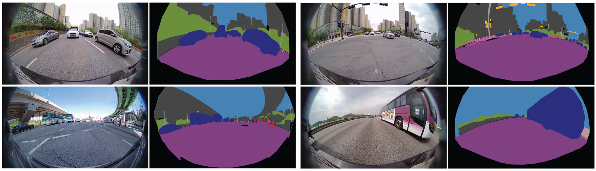
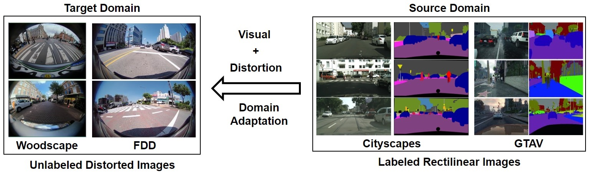

## [DaDA: Distortion-aware Domain Adaptation for Unsupervised Semantic Segmentation](https://openreview.net/pdf?id=6RoAxmwj0L2) [NeurIPS 2022, Oral]


#### *Update (11/24/2022): FDD Dataset is publicly available! You can download the dataset [here](https://forms.gle/GfsbMgE9wwocasas8).

Distributional shifts in photometry and texture have been extensively studied for unsupervised domain adaptation, but their counterparts in optical distortion have been largely neglected.
We tackle the task of unsupervised domain adaptation for semantic image segmentation where unknown optical distortion exists between source and target images.
For this, we release [*Fisheye Driving Dataset* (FDD)](https://forms.gle/GfsbMgE9wwocasas8) that includes semantically annotated images captured by fisheye cameras (200&deg; F.O.V) at front- and rear-side of the vehicle.
<p align="center">
    
</p>

With the FDD and other public datasets, we newly introduce unsupervised domain adaptation tasks involving not only visual domain shifts (e.g., texture, lighting, contrast) but also geometric deformation (e.g., radial distortion) between source and target images.
Below we evaluate our [*Distortion-aware Domain Adaptation (DaDA)*](https://openreview.net/pdf?id=6RoAxmwj0L2) framework that is capable of modeling domain shifts in geometric deformation based on a relative distortion learning (RDL) method.
We hope our work provides a solid baseline and new perspectives on distortion-aware domain adaptation.
<p align="center">
    
</p>

## Comparisons with the baseline adaptation methods
Below table summarizes the effect of our framework when applied to the based adaptation methods.

||Cityscapes [1] &rarr; Woodscape [2]|GTAV [3] &rarr; Woodscape [2]|Cityscapes [1] &rarr; [FDD](https://forms.gle/GfsbMgE9wwocasas8)|GTAV [3] &rarr; [FDD](https://forms.gle/GfsbMgE9wwocasas8)|
|:-:|:-:|:-:|:-:|:-:|
|**Method**                      | **mIoU(%)** | **mIoU(%)**   | **mIoU(%)**   | **mIoU(%)**   |
| Source Only                      | 32.39         | 29.32         | 34.76         | 32.13         |
||||||                           
| AdaptSeg [5]                     | 46.33         | 35.94         | 39.07         | 36.90         |
| AdaptSeg+RA*                    | 50.44         | 36.88         | 39.42         | 37.22         |
| AdaptSeg+**RDL**                 | 50.88         | 37.36         | **41.35**     | 39.29         |
| AdaptSeg+RA+**RDL**              | **52.59**     | **37.73**     | 41.07         | **39.64**     |
||||||                           
| AdvEnt [6]                       | 45.26         | 34.70         | 38.87         | 37.25         |
| AdvEnt+RA                        | 50.60         | 36.64         | 41.58         | 38.75         |
| AdvEnt+**RDL**                   | 50.94         | 36.39         | **42.43**     | 39.93         |
| AdvEnt+RA+**RDL**                | **52.64**     | **37.62**     | 42.32         | **40.87**     |

*RA: Randaugment [6]

## Effect of DaDA on Self-Supervised Learning (SSL)
We also evaluate the effect of our distortion-aware domain adaptation (DaDA), as a “warm-up” phase, for state-of-the-art adaptation methods using self-supervised learning.

| |Cityscapes [1] &rarr; Woodscape [2]|GTAV [3] &rarr; Woodscape [2]|Cityscapes [1] &rarr; [FDD](https://forms.gle/GfsbMgE9wwocasas8)|GTAV [3] &rarr; [FDD](https://forms.gle/GfsbMgE9wwocasas8)|
|:-:|:-:|:-:|:-:|:-:|
|**SSL Method**|**mIoU(%)**|**mIoU(%)**|**mIoU(%)**|**mIoU(%)**|
|IAST [7]      | 47.00     | 38.83     | 39.60     | 37.47     |
|IAST+DaDA    |   53.82   | **40.75** |   44.46   |   40.06   |
|IntraDA [8]   | 48.92     | 36.10     | 40.36     | 38.61     |
|IntraDA+DaDA |   53.24   |   39.85   | **45.28** | **42.10** |
|ProDA [9]    | 50.69     | 34.44     | 39.72     | 35.97     |
|ProDA+DaDA   | **54.83** |   35.75   |   42.14   |   37.09   |


## Dataset Organization

Below folder structure outlines the contents of Distortion-aware Domain Adaptation Benchmarks datasets.
We provide the complete set of the [FDD dataset](https://forms.gle/GfsbMgE9wwocasas8).
However, we only provide information of classes and train/val file lists for other public datasets and you should download them individually ([Woodscape](https://github.com/valeoai/WoodScape), [Cityscapes](https://www.cityscapes-dataset.com/), [GTAV](https://download.visinf.tu-darmstadt.de/data/from_games/index.html)).

```

## Fisheye Driving Dataset
fdd_trainval (FDD)
│   info_fdd.json (classes, label2train, label, palette)
│   train.txt (list of images and labels for training)
│   val.txt (list of images and labels for validation)
│
└───train
│   └───image
│   │   │   svm_front_[ID].png
│   │   │   ...
│   │   │   svm_rear_[ID].png
│   │   │   ...
│   │
│   └───label
│       │   svm_front_[ID].png
│       │   ...
│       │   svm_rear_[ID].png
│       │   ...
│       
└───val
    └───image
    │   │   svm_front_[ID].png
    │   │   ...
    │   │   svm_rear_[ID].png
    │   │   ...
    │   
    └───label
        │   svm_front_[ID].png
        │   ...
        │   svm_rear_[ID].png
        │   ...

## Other Datasets for Distortion-aware Domain Adaptation Benchmarks
## Here we only provide annotation classes and train/val file lists used for our benchmarks.
woodscape_trainval (woodscape)
│   info_woodscape.json (classes, label2train, label, palette)
│   train.txt (list of images and labels for training)
│   val.txt (list of images and labels for validation)

cityscapes_trainval (Cityscapes)
│   info_fdd.json (classes, label2train, label, palette for FDD as target)
│   info_woodscape.json (classes, label2train, label, palette for Woodscape as target)
│   train.txt (list of images and labels for training)
│   val.txt (list of images and labels for validation)

gtav_trainval (GTAV)
│   info_fdd.json (classes, label2train, label, palette for FDD as target)
│   info_woodscape.json (classes, label2train, label, palette for Woodscape as target)
│   train.txt (list of images and labels for training)
│   val.txt (list of images and labels for validation)

```

## Citation

If you like our work and find this dataset useful, please cite our [paper](https://openreview.net/pdf?id=6RoAxmwj0L2):

```
@inproceedings{
	jang2022dada,
	title={Da{DA}: Distortion-aware Domain Adaptation for Unsupervised Semantic Segmentation},
	author={Sujin Jang and Joohan Na and Dokwan Oh},
	booktitle={Advances in Neural Information Processing Systems},
	year={2022}}
```

## Authors

[Sujin Jang (장수진)](https://sujinjang.github.io/), [Joohan Na (나주한)](https://linkedin.com/in/najoohan), [Dokwan Oh (오도관)](https://linkedin.com/in/dokwan-oh-18a26572)

## License Agreement

SAIT ([Samsung Advanced Institute of Technology](https://www.sait.samsung.co.kr/saithome/main/main.do)) releases the FDD dataset to encourage the research community to develop perception algorithms for autonomous driving and other relevant fields of study. 
This FDD dataset is made freely available to academic and non-academic entities for non-commercial purposes including research, scientific publications, teaching, and personal non-profit experimentation. 
You shall (1) not use the dataset or any derivative work for commercial purposes, i.e., commercial advantage or monetary compensation, and (2) not redistribute this dataset or modified versions without permission.


## References

[1] Cordts, Marius, et al. "The cityscapes dataset." CVPR Workshop on the Future of Datasets in Vision. Vol. 2. sn, 2015. \
[2] Yogamani, Senthil, et al. "Woodscape: A multi-task, multi-camera fisheye dataset for autonomous driving." Proceedings of the IEEE/CVF International Conference on Computer Vision. 2019. \
[3] Richter, Stephan R., et al. "Playing for data: Ground truth from computer games." European conference on computer vision. Springer, Cham, 2016. \
[4] Tsai, Yi-Hsuan, et al. "Learning to adapt structured output space for semantic segmentation." Proceedings of the IEEE conference on computer vision and pattern recognition. 2018. \
[5] Vu, Tuan-Hung, et al. "Advent: Adversarial entropy minimization for domain adaptation in semantic segmentation." Proceedings of the IEEE/CVF Conference on Computer Vision and Pattern Recognition. 2019. \
[6] Cubuk, Ekin D., et al. "Randaugment: Practical automated data augmentation with a reduced search space." Proceedings of the IEEE/CVF conference on computer vision and pattern recognition workshops. 2020. \
[7] Mei, Ke, et al. "Instance adaptive self-training for unsupervised domain adaptation." European conference on computer vision. Springer, Cham, 2020. \
[8] Pan, Fei, et al. "Unsupervised intra-domain adaptation for semantic segmentation through self-supervision." Proceedings of the IEEE/CVF Conference on Computer Vision and Pattern Recognition. 2020. \
[9] Zhang, Pan, et al. "Prototypical pseudo label denoising and target structure learning for domain adaptive semantic segmentation." Proceedings of the IEEE/CVF conference on computer vision and pattern recognition. 2021.